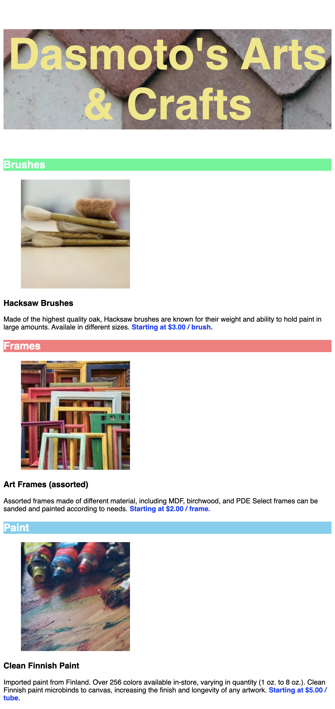

# Dasmoto's Arts & Craft

> Create a webpage using HTML and CSS when given a requested spec.

## Table of Contents

- [General Info](#general-information)
- [Technologies Used](#technologies-used)
- [Screenshots](#screenshots)
- [Room for Improvement](#room-for-improvement)

## General Information

The purpose is recreate a simple landing page for an art store following specific design specifications.
-This project is part of the Codecademy Fullstack Career Path

## Technologies Used

-HTML
-CSS

## Screenshots

Given Spec

Replicated results

## Room for Improvement

Need to learn how to better format header and title bars in css.
